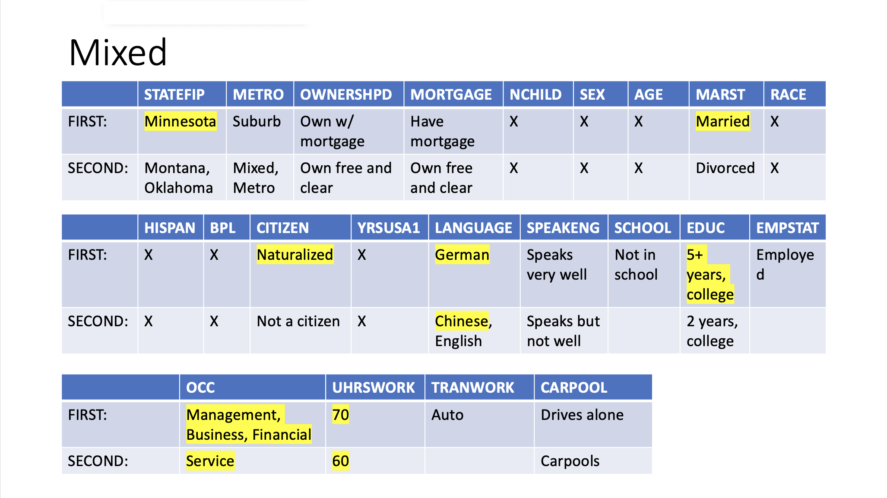

# Census Income Mobility: Predicting and Improving Economic Outcomes

Master's capstone project analyzing U.S. Census microdata (IPUMS USA) to understand what factors are associated with income, and to explore — via reinforcement learning — which of those factors, if changed, would move a given person into a higher income bracket. The dataset was filtered to only look at the immigrant population.

## Project Overview

The project has two connected goals:

1. **Predict income tier from a census profile.** A Random Forest classifier takes a person's demographic/socioeconomic profile (state, education, occupation, English proficiency, citizenship, etc.) and predicts which income tier they fall into.
2. **Recommend which characteristics to change to raise income.** A custom Q-learning agent treats a census profile as a "state" and treats changes to individual characteristics (e.g., increasing education level, changing occupation, improving English proficiency) as "actions." The agent learns, for people with different starting backgrounds (e.g., country of origin, English proficiency, industry), which sequence of realistic changes tends to move them into a higher predicted income tier.

The Random Forest model's predicted probabilities are used as the reward signal that trains the RL agent — the two pieces are meant to work together rather than as separate analyses.

## Data Source

Data comes from **IPUMS USA**, the harmonized U.S. Census/American Community Survey microdata repository ([usa.ipums.org](https://usa.ipums.org)). Each record is one person, with variables such as `INCTOT` (total income), `EDUC` (education), `OCC` (occupation), `BPL` (birthplace), `CITIZEN`, `SPEAKENG` (English-speaking ability), `LANGUAGE`, `MARST`, `STATEFIP`, and others. Raw extracts and the IPUMS DDI codebooks are not included in this repo (see [Data Not Included](#data-not-included) below) — you'll need to pull your own extract from IPUMS to rerun the pipeline.

## Repository Contents

| File | Language | Purpose |
|---|---|---|
| `census_data_cleaning.r` | R | Loads a raw IPUMS extract, filters and subsets it down to the variables used in the project, splits records into income tiers/quartiles, and exports cleaned data to Excel/CSV for use in Python. |
| `census_analysis.py` | Python | Exploratory analysis of the cleaned data — computes, per income group, the probability distribution of each characteristic (education, occupation, English proficiency, etc.), and uses those distributions to estimate the likelihood of a given profile landing in each income group/quartile. |
| `Census_Income_Predictor_RF.py` | Python | Trains a `RandomForestClassifier` (scikit-learn) to predict income tier from a census profile. Includes preprocessing (missing-value imputation, label encoding), model training with cross-validation, feature importance analysis, and single-profile prediction. |
| `RL_Agent_Final.py` | Python | Implements a tabular Q-learning agent. States are census profiles; actions are realistic single-characteristic changes (e.g., a new occupation code, an additional year of English proficiency, a higher education level). The agent is trained/evaluated using the Random Forest model above to score each resulting state, with a q-table, epsilon-greedy exploration, and reward tracking/plotting utilities. |
| `Error_Analysis.xlsx` | Excel | Error analysis of the Random Forest income predictor, comparing performance across a 6-tier and a 4-tier income classification scheme (confusion matrices / misclassification breakdowns by tier). |
| `Capstone_Final_Presentation.pptx` | PowerPoint | Final presentation summarizing the project's motivation, methodology, and findings. |

## Methodology

**1. Preprocessing (`census_data_cleaning.r`)**
Raw IPUMS microdata is read in via `ipumsr`, filtered to remove invalid/missing income codes and records outside the years of interest, and restricted to a set of birthplace codes relevant to the analysis. Records are bucketed into income tiers (based on quartile cutoffs derived from the data, e.g. ~$6,000 / $21,600 / $50,000) and exported for use downstream.

**2. Exploratory profile analysis (`census_analysis.py`)**
For each income group, the script computes the relative frequency of each value of each characteristic (education, occupation, English proficiency, etc.), normalizes across groups, and combines these into a rough probability of belonging to a given income group for an arbitrary profile.

**3. Income prediction (`Census_Income_Predictor_RF.py`)**
A Random Forest classifier is trained on the cleaned profiles to predict income tier, with standard preprocessing (imputation, encoding) and evaluation (accuracy, cross-validation, classification report, confusion matrix, feature importance).

**4. Reinforcement learning agent (`RL_Agent_Final.py`)**
Each person's profile is treated as a state in a Q-learning framework. The action space is a constrained, realistic set of single-variable changes per characteristic (e.g., a handful of the most common occupation codes, a small number of English-proficiency levels, +1/+2 education steps) rather than every possible value, to keep the state/action space tractable. The reward for a given state is derived from the Random Forest model's predicted income-tier probabilities, so the agent learns which changes are associated with the model predicting a higher income tier. Reward trends are tracked and plotted over training episodes to evaluate whether the agent is learning a useful policy.

**5. Error analysis (`Error_Analysis.xlsx`)**
Compares classifier performance under a finer-grained 6-tier income scheme versus a coarser 4-tier scheme, to understand where and how the model's misclassifications cluster.

## Results

This is my table of results. It's labeled "Mixed" because it was trained on different starting points from different income brackets. The "First" row is the top characteristic that increased the likelihood of moving up an income bracket, and the "Second" row is the next-best characteristic. Notable characteristics were the state lived in (`STATEFIP`), language spoken at home (`LANGUAGE`), and occupation (`OCC`) — these show what actions immigrants can take to increase their chance of moving up an income bracket.

## Notes on the Code

This repository reflects an actual research/capstone workflow rather than a polished production pipeline:
- Scripts assume input files (raw IPUMS extracts, intermediate `.xlsx`/`.pickle` files) exist locally and reference local file paths — you'll need to adjust these paths and regenerate intermediate files for your own run.
- `census_analysis.py` and `RL_Agent_Final.py` were run and iterated on interactively (e.g., in Jupyter/RStudio), so they contain exploratory/debugging code, commented-out alternate approaches, and some cells that depend on variables defined earlier in an interactive session rather than in the file itself.

## Data Not Included

Raw and intermediate data files (IPUMS extracts, DDI codebooks, tiered `.xlsx`/`.pickle` files referenced in the scripts) are not included in this repository due to size and IPUMS' data redistribution terms. To reproduce the pipeline, request your own extract from [IPUMS USA](https://usa.ipums.org) with the variables listed in `census_data_cleaning.r`.

## Tech Stack

- **R**: `ipumsr`, `writexl`
- **Python**: `pandas`, `numpy`, `scikit-learn`, `matplotlib`, `seaborn`, `pickle`

## Author's Note

This was completed as a master's capstone project exploring whether census-based income prediction, combined with reinforcement learning, could surface actionable, background-specific insight into what tends to be associated with upward income mobility.
